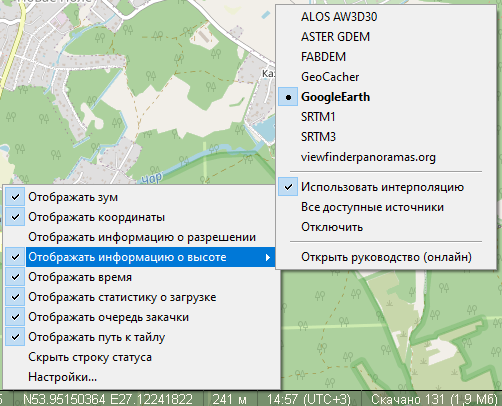

# Высота над уровнем моря

SAS.Планета уже давно имеет возможность запрашивать значение высоты над уровнем моря с ресурсов SRTM3 и GTOPO30. Для этого следует установить курсор на нужную точку, вызвать контекстное меню и в нём выбрать "Дополнительные операции -> Высота над уровнем моря...". В открывшемся окне браузера появится значение высоты в метрах. Хотя полезность данной фичи неоспорима, её удобство оставляет желать лучшего, ведь для каждой точки приходится залезать в меню, а затем закрывать окно браузера. И невозможна работа оффлайн.

Начиная с версии 140303, программа получила возможность отображения **в строке состояния** высоты над уровнем моря для точки под курсором. Значения высоты меняются синхронно с движением курсора, никаких дополнительных нажатий не требуется. Все данные хранятся на локальном компьютере, что позволяет работать без доступа в Интернет. Настройка отображения осуществляется через меню строки состояния. Доступ к этому меню: установить курсор на строку состояния и нажать правую кнопку мыши.

Данные для отображения высоты могут браться из нескольких источников: ASTER GDEM, SRTM3, viewfinderpanoramas.org, ALOS AW3D30, FABDEM, а также из кэша Google Earth, кэша GeoCacher. 

Выделенный точкой источник является основным, из него программа будет брать данные для отображения. Опция "**Все доступные источники**": если основной источник не содержит данных, то программа будет пытаться получить данные из любого другого источника. При включенной опции "Все доступные источники" жирным шрифтом будет выделен источник, из которого взяты данные высот, если их нет в основном. Если выбрана опция **"Отключить"**, значение высоты в строке состояния показываться не будет. Чтобы снова включить отображение высоты, следует назначить какой-либо источник данных основным. Опция "**Использовать интерполяцию**" позволяет получить более точную высоту с плавным ее изменением, что особенно актуально для гор. Без этой опции в горах высота будет меняться скачкообразно. Для источников данных с низким разрешением скачки могут составлять 10-20м.

Поскольку все описываемые источники данных локальные, для правильной работы необходимо предварительно сохранить нужные данные в соответствующих папках.
Основная папка для хранения данных высот - `.\TerrainData`. В ней лежит файл `SASTerrain.Default.ini` с дефолтными настройками. Его нужно переименовать в `SASTerrain.ini`, после чего его можно использовать и (при необходимости) вносить свои изменения. 

Внутри файла SASTerrain.ini описаны все возможные (перечисленные выше) источники данных высот, актуальная структура папок в папке \TerrainData (она иногда меняется), а также более-менее актуальные ссылки на ресурсы, где можно взять файлы с данными высот.

Открываем файл SASTerrain.ini в блокноте.

Рассмотрим на примере источника `[SRTM3]`:

- `Folder='TerrainData\srtm\'` - папка для хранения файлов с данными высот - `TerrainData\srtm\`. В эту папку нужно поместить распакованные файлы высот в формате `*.hgt` без дальнейших вложенных подкаталогов. 

- `Info='https://srtm.kurviger.de/SRTM3/'` - ссылка на актуальный ресурс с файлами данных. Если ссылка не открывается, самостоятельно ищем в интернете по запросу "srtm3 download".

Скачивать нужно ту область, для которой требуется отобразить высоту. Для удобства можно в настройках установить Формат представления координат - WS... во вкладке "Вид", и данные для поиска нужной области будут отображаться в левом нижнем углу (см. скриншот выше). Для области на скриншоте соответствующий файл высот будет называться **N53E027.hgt**.